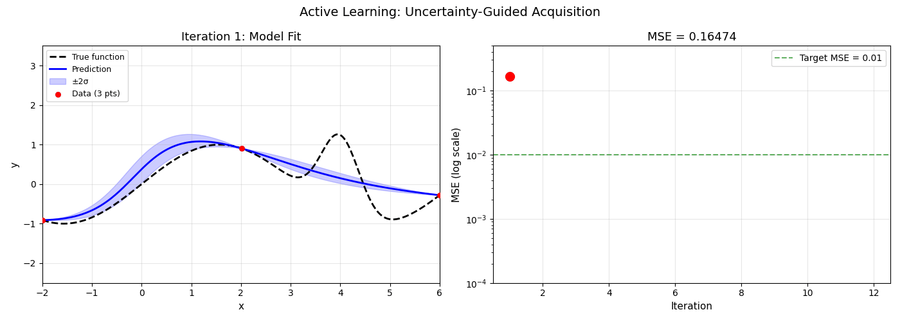

# Deep-UQ

<p align="center">
  
</p>

<p align="center">
  <strong>The most comprehensive uncertainty quantification toolkit for deep learning in PyTorch.</strong>
</p>

<p align="center">
  <a href="https://github.com/Vispikarkaria/Deep-UQ/actions/workflows/tests.yml"></a>
  <a href="https://github.com/Vispikarkaria/Deep-UQ/actions/workflows/lint.yml"></a>
  <a href="https://github.com/Vispikarkaria/Deep-UQ/actions/workflows/docs.yml"></a>
  <a href="https://pypi.org/project/uqdeepnn/"></a>
  <a href="https://github.com/Vispikarkaria/Deep-UQ/blob/master/LICENSE"></a>
</p>

<p align="center">
  
</p>

---

## Why Deep-UQ?

Most UQ libraries focus on one method. Deep-UQ provides **20+ method families** behind a single `predict_uq()` API, works with any PyTorch model, and includes scientific ML architectures as first-class citizens — all with **zero external UQ dependencies**.

```python
from deepuq.models import MLP
from deepuq.methods import LaplaceWrapper

model = MLP(input_dim=1, hidden_dims=[64, 64], output_dim=1)
# ... train model ...

la = LaplaceWrapper(model, likelihood="regression", hessian_structure="kron")
la.fit(train_loader)
la.optimize_prior_precision()

result = la.predict_uq(x_test)
# result.mean, result.epistemic_var, result.aleatoric_var, result.total_var
```

---

## Install

```bash
pip install uqdeepnn          # from PyPI (v0.2.0)
pip install -e ".[dev,tests]" # from source
```

---

## UQ Methods (20+)

### Bayesian & Ensemble Methods

| Method | Key Classes | What it does |
|--------|-------------|--------------|
| **Deep Ensembles** | `DeepEnsembleRegressor` | Train N models, aggregate mean/variance |
| **Batch Ensemble** | `BatchEnsembleWrapper` | N members in ~1× memory via rank-1 perturbations |
| **Packed Ensemble** | `PackedEnsembleWrapper` | Channel-grouped sub-networks in one model |
| **SWAG** | `SWAGWrapper`, `MultiSWAG` | Single-run Bayesian via SGD trajectory moments |
| **Variational Inference** | `BayesByBackpropMLP` | Gaussian weight posteriors via ELBO |
| **SVGD** | `SVGDWrapper` | Particle-based variational inference |

### Post-Hoc & Single-Pass Methods

| Method | Key Classes | What it does |
|--------|-------------|--------------|
| **Laplace Approximation** | `LaplaceWrapper` | Post-hoc Gaussian posterior (6 Hessian structures + GLM predictive) |
| **SNGP** | `SNGPWrapper` | Single forward pass, distance-aware uncertainty |
| **Evidential DL** | `EvidentialRegression`, `EvidentialClassification` | Single pass via NIG/Dirichlet parameterization |
| **MC Dropout** | `MCDropoutWrapper` | Dropout at test-time for uncertainty |
| **Test-Time Augmentation** | `TTAWrapper` | Uncertainty from input perturbations (any model) |
| **Temperature Scaling** | `TemperatureScaling`, `IsotonicCalibration` | Post-hoc calibration |

### MCMC & Sampling

| Method | Key Classes | What it does |
|--------|-------------|--------------|
| **SGLD** | `SGLDOptimizer` | Posterior samples via noisy SGD |
| **SGHMC** | `SGHMCOptimizer` | Momentum-based stochastic gradient MCMC |
| **Cyclical SGMCMC** | `CyclicalSGMCMC` | Cosine-annealed cycles for better posterior coverage |

### Gaussian Processes

| Method | Key Classes | What it does |
|--------|-------------|--------------|
| **Exact GP** | `GaussianProcessRegressor` | Full GP regression |
| **Sparse GP** | `SparseGaussianProcessRegressor` | Inducing-point approximation |
| **Multi-Fidelity GP** | `MultiFidelityGP` | Combine cheap/expensive simulations |
| **Deep Kernel** | `DeepKernelGP` | Neural feature extractor + GP |
| **Multi-task** | `MultitaskGP` | Correlated outputs via ICM |

### Distribution-Free & Decision Methods

| Method | Key Classes | What it does |
|--------|-------------|--------------|
| **Conformal Prediction** | `SplitConformalRegressor` | Distribution-free coverage guarantees |
| **Weighted Conformal** | `WeightedConformalPredictor` | Coverage under distribution shift |
| **Adaptive Conformal** | `AdaptiveConformalPredictor` | Online threshold for streaming data |
| **Selective Prediction** | `SelectivePredictor` | Reject uncertain predictions (AURC) |

All methods return a **`UQResult`** with `.mean`, `.epistemic_var`, `.aleatoric_var`, `.total_var`.

---

## Beyond Prediction: Full UQ Toolkit

### Evaluation Metrics (`deepuq.metrics`)
ECE, CRPS, Brier score, NLL, interval score, PICP, AUROC, FPR@TPR, AURC, risk-coverage curves.

### Active Learning (`deepuq.active`)
Uncertainty-guided data acquisition with `UncertaintySampling`, `BALDSampling`, and `ActiveLearningLoop`.

### Physics Constraints (`deepuq.constraints`)
Enforce positivity, bounds, conservation laws, and monotonicity on uncertainty predictions.

### Uncertainty Propagation (`deepuq.propagation`)
Track uncertainty growth in autoregressive rollouts via moment matching or sampling.

---

## Model Architectures

| Family | Classes | UQ Compatibility |
|--------|---------|-----------------|
| Dense | `MLP`, `PINN1D`, `PINN2D` | All methods |
| Spatial | `CNNRegressor2D`, `ResNetRegressor2D`, `UNet2D` | Ensembles, MC Dropout, Laplace |
| Operators | `DeepONet1D`, `DeepONet2D`, `FNO2D`, `FNO3D` | Laplace, Ensembles |
| Graph | `GraphNeuralOperator2D` | Ensembles, Laplace |
| GPs | All GP classes | Native Bayesian |

---

## Tutorials

**50+ executable notebooks** covering every method and architecture:

| Category | Notebooks |
|----------|-----------|
| Core UQ | SWAG, SNGP, Batch Ensemble, Evidential, Calibration, SGHMC, SVGD, TTA, Selective Prediction |
| Conformal | Split, CQR, Weighted, Adaptive |
| Scientific ML | DeepONet, FNO, GNO, PINN, CNN/UNet surrogates |
| Gaussian Processes | Exact, Sparse, Multi-task, Deep Kernel, Multi-Fidelity |
| Evaluation | Metrics, Active Learning (with animation), Uncertainty Propagation, Physics Constraints |
| Classic | MC Dropout, SGLD, Bayes by Backprop, Laplace comparison |

---

## Documentation

| Resource | Link |
|----------|------|
| Full docs | https://vispikarkaria.github.io/Deep-UQ/ |
| API reference | https://vispikarkaria.github.io/Deep-UQ/api/ |
| Method guides | https://vispikarkaria.github.io/Deep-UQ/methods/ |
| Tutorials | https://vispikarkaria.github.io/Deep-UQ/tutorials/ |
| Benchmarks | https://vispikarkaria.github.io/Deep-UQ/benchmarks/ |
| Roadmap | https://vispikarkaria.github.io/Deep-UQ/roadmap/ |

---

## Contributing

```bash
git clone https://github.com/Vispikarkaria/Deep-UQ.git && cd Deep-UQ
pip install -e ".[dev,tests]" && pre-commit install
pytest -q && ruff check . && black --check .
```

See [CONTRIBUTING.md](CONTRIBUTING.md) for full guidelines.

---

## Citation

```bibtex
@software{deep_uq,
  title = {Deep-UQ: Unified Deep Learning Uncertainty Quantification Toolkit},
  author = {Karkaria, Vispi Nevile},
  year = {2024},
  url = {https://github.com/Vispikarkaria/Deep-UQ},
  license = {MIT}
}
```

---

## License

MIT
